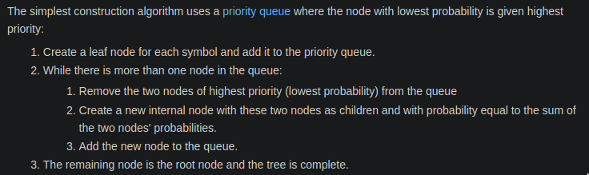

# 6.004 Computation Structures

---

## Lecture- 1

1. What is information? 
Data communicated or recieved that resolves uncertainity about a fact or circumstance. In other words after receiving the data we'll know more about that particular fact or circumstance.

2. Claude Shannon, in his seminal work on the theory, defined the information received when learning that $X$ had taken on the value $x_i$ as
$$I(x_i) = \log_2 \frac{1}{p_i} \text{bits}$$

3. This example is one we encounter often: we receive partial information about $N$ equally probable choices that narrows down the number of choices down to $M$. The probability of such information is $M(1/N)$, so the information content is 
$$  I(\textrm{N choices $\rightarrow$ M choices}) = \log_2 \frac{1}{M(1/N)} = \log_2 \frac{N}{M} \textrm{ bits}.$$

4. In information theory, the entropy $H(X)$ is the average amount of information contained in each piece of data received about the value $X$:
$$H(X) = E(I(X)) = \sum_i p_i \log_2 \frac{1}{p_i}$$

5. An encoding is an unambiguous mapping between bit strings and set of possible data.

6. How unsigned integers are represented - binary notation, hexadecimal. Signed maginuted notation. Two's compliment form.

7. Fixed-length encodings work well when all the possible choices have the same information content i.e, all the choices have an equal probability of occurring. If those choices don't have the same content, we can do better. Using variable length encodings.

8. High probability(Less information), Low probability(More information)

9. **Huffman's Algorithm**: Given a set of symbols and their probabilities, Huffman's algorithm tells us how to construct optimal variable-length encoding. By "optimal" we mean that, assuming we are encoding each symbol one at a time, no other variable-length code will have a shorter expected length.   
	
	
10. **Hamming Distance**: The number of positions in which the corresponding digits differ in two encodings of same length.

***